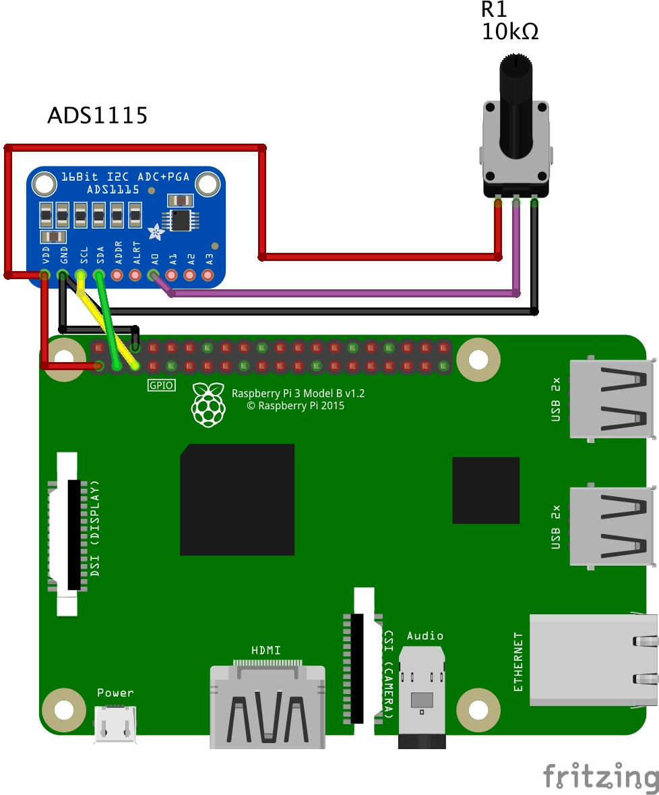

# Simple demo of MQTT -> Processing bridge for I2C sensors

The Python script and the Processing script working together demonstrate usage of MQTT bridge in order to access a wide range of I2C sensors.

Installation requirements:

- Adafruit Adafruit_ADS1x15 Python library (follow installation instructions at https://github.com/adafruit/Adafruit_Python_ADS1x15)
- Mosquitto (`apt-get install mosquitto`), then start the MQTT service: `mosquitto -d && sudo systemctl enable mosquitto.service`
- Paho-mqtt (`pip3 install paho-mqtt` if using Python 3, `pip install paho-mqtt` for Python 2)
- Processing MQTT library (use library manager within Processing, search for `MQTT`)

After installation of necessary libraries, launch the Python script (`python3 mqtt-sensor-infinite.py`) and then launch the Processing sketch (`mqtt_test/mqtt_test.pde`) on the Raspberry Pi to see the readings being translated to the size of the circle:

## Connections:

Please see the schematics in `schematics folder`:
